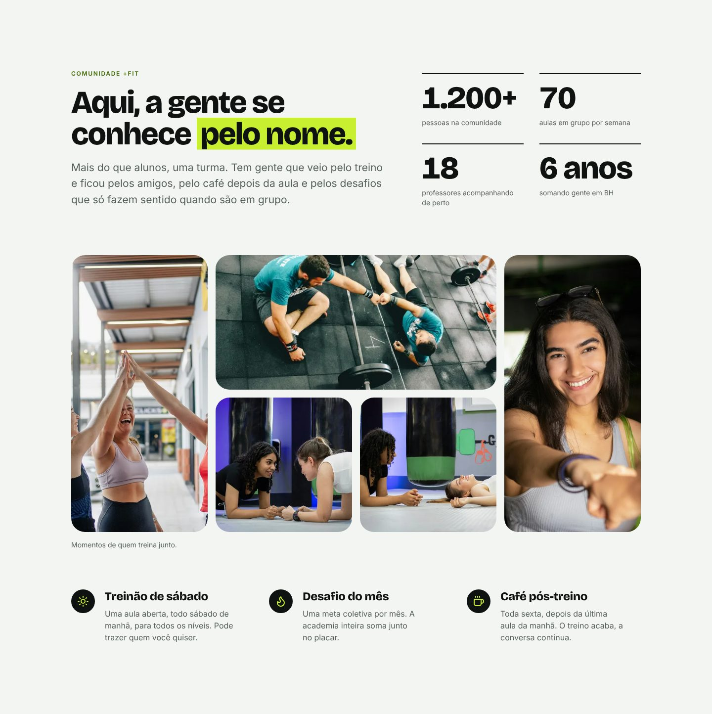

# +Fit — Landing page

Landing page de uma academia **fictícia** em Belo Horizonte (Savassi), criada para o meu portfólio. A ideia central é **comunidade e pertencimento**: o visual é limpo e cheio de respiro, mas com a energia de uma academia de alto padrão, e todo o texto fala no "nós" e no "juntos".

> **Projeto fictício.** Marca, endereço, telefone, preços, números e depoimentos são inventados. O formulário de contato valida os dados no navegador e **não envia nada**.

**Demo:** _(link da Vercel — adicione aqui após o deploy)_


<p>
  
</p>

## O que tem na página

Hero · Manifesto · Comunidade (números animados e mosaico de fotos) · Modalidades · Estrutura · Depoimentos · Planos · Perguntas frequentes · Chamada final · Contato (formulário com validação) · Rodapé.




## Stack

- **React 19** + **TypeScript** + **Vite 8**
- **Tailwind CSS 4** com tokens próprios (`@theme`); a paleta padrão foi desligada de propósito
- **Lucide** para ícones; fontes **Bricolage Grotesque** e **Inter** auto-hospedadas (Fontsource)
- ESLint (com `jsx-a11y`) e Prettier
- Sem bibliotecas de animação, UI kits, analytics ou backend

## Decisões de design

- **Direção "Juntos":** branco + grafite + um único destaque em lima. O lima é tempero: aparece em botões, palavras-chave e pequenos ícones, nunca como texto sobre fundo claro.
- **Ritmo de fundos** que alterna seções claras e escuras, para a página respirar.
- **Fotos de grupo**, sem o clichê do atleta solitário no espelho.
- **Movimento discreto:** entrada do hero, revelação no scroll e contadores, tudo só com CSS e `IntersectionObserver`, e desligado com `prefers-reduced-motion`.
- **Conteúdo separado da interface:** todos os textos ficam em `src/data/`, tipados.

Detalhes completos em [`docs/design-system.md`](docs/design-system.md) e [`docs/conteudo.md`](docs/conteudo.md).

## Acessibilidade e performance

- axe-core sem violações; Lighthouse de Acessibilidade 100.
- Landmarks e hierarquia de títulos corretas, link "Pular para o conteúdo", foco visível, navegação completa por teclado, menu mobile com foco preso e fecha com Esc.
- Formulário com rótulos, erros ligados por `aria-describedby`, foco no primeiro campo inválido.
- Sem rolagem horizontal de 320 a 1920 px.
- Lighthouse (build de produção): **celular** 92 / 100 / 100 / 100 e **desktop** 100 / 100 / 100 / 100 (Desempenho / Acessibilidade / Boas práticas / SEO).
- Imagens em WebP com várias larguras, `srcset`, dimensões fixas e carregamento preguiçoso; foto do hero e fontes com `preload`; CSS crítico inline; Open Graph e `sitemap.xml` gerados no build.
- Limitação conhecida: a página é renderizada no navegador (SPA), então o LCP no celular fica perto de 3 s.

## Como rodar

Precisa do Node.js 20.19 ou superior (ou 22.12+), exigência do Vite 8.

```bash
npm install
npm run dev
```

| Script                 | O que faz                                |
| ---------------------- | ---------------------------------------- |
| `npm run dev`          | Servidor de desenvolvimento              |
| `npm run build`        | Checagem de tipos + build de produção    |
| `npm run preview`      | Serve o build localmente                 |
| `npm run lint`         | ESLint (inclui regras de acessibilidade) |
| `npm run format`       | Formata o código com Prettier            |
| `npm run format:check` | Só confere a formatação                  |

## Deploy na Vercel

1. Importe o repositório na Vercel (o Vite é detectado sozinho).
2. Comando de build `npm run build` e pasta de saída `dist`.
3. Opcional: se usar domínio próprio, defina a variável `SITE_URL` (ex.: `https://meusite.com`). Ela alimenta o canonical, o Open Graph e o `sitemap.xml`. Sem ela, a Vercel usa o domínio de produção do projeto.

## Estrutura

```
src/
├── components/   ui/ (Button, Section, PhotoImage…) e layout/ (Navbar, Footer)
├── sections/     uma seção da página por arquivo
├── data/         textos, planos, depoimentos e fotos
├── hooks/ lib/   useReveal, useActiveSection, utilitários
└── styles/       tokens do tema e animações
docs/             design system, conteúdo e créditos das imagens
```

## Créditos

- **Fotografias:** [Unsplash](https://unsplash.com), sob a [Unsplash License](https://unsplash.com/license). Autores e edições (recortes e desfoque pontual de marcas) em [`docs/creditos-imagens.md`](docs/creditos-imagens.md).
- **Fontes:** Bricolage Grotesque e Inter (SIL Open Font License).
- **Ícones:** [Lucide](https://lucide.dev).

Projeto desenvolvido por Vinicius.
